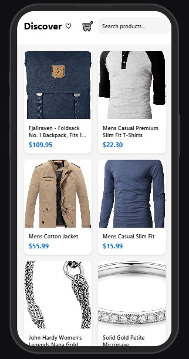

# E-Commerce Product Listing App

A React Native e-commerce app that displays products from FakeStore API, featuring product listings, cart management, wishlist functionality, and search/filter capabilities.

## Features

- 📱 Product grid layout with images, titles, and prices
- 🔍 Search functionality for products
- 🏷️ Category-based filtering
- 💝 Wishlist management
- 🛒 Shopping cart with AsyncStorage persistence
- 📦 Product details view
- 💫 Smooth navigation between screens

<h2>📸 Screenshots</h2>
<p>Here are a few glimpses of the E Commerce App in action:</p>

<table>
  <tr>
    <th>Home Screen</th>
    <th>Product details</th>
    <th>Cart</th>
  </tr>
  <tr>
    <td></td>
    <td></td>
    <td></td>
  </tr>
  <tr>
    <th>Wishlist</th>
    <th>Searchbar</th>
  </tr>
  <tr>
    <td></td>
    <td></td>
   
  </tr>
</table>

<hr>

## Tech Stack


<!-- Or use this cool banner style -->
<div align="center">
  
  
  
</div>

### Development Environment

<p align="center">
  <a href="https://code.visualstudio.com/">
    
  </a>
  <a href="https://nodejs.org/">
    
  </a>
  <a href="https://git-scm.com/">
    
  </a>
</p>

### API Integration

<p align="center">
  <a href="https://fakestoreapi.com/">
    
  </a>
</p>

<p align="center">
  
  
  
</p>

### Project Stats

<p align="center">
  
  
  
</p>

## Prerequisites

Before you begin, ensure you have the following installed:
- [Node.js](https://nodejs.org/) (v14 or newer)
- [npm](https://www.npmjs.com/) or [yarn](https://yarnpkg.com/)
- [Expo CLI](https://docs.expo.dev/get-started/installation/)
- [Android Studio](https://developer.android.com/studio) (for Android development)
- [Xcode](https://developer.apple.com/xcode/) (for iOS development, macOS only)

## Installation

1. Clone the repository:
```bash
git clone https://github.com/vaibhavk10/E_Commerce_APP.git
cd E_Commerce_APP
```

2. Install dependencies:
```bash
npm install
```

3. Start the development server:
```bash
npx expo start
```

4. Run on your preferred platform:
- Press `a` for Android
- Press `i` for iOS
- Scan QR code with Expo Go app on your mobile device
